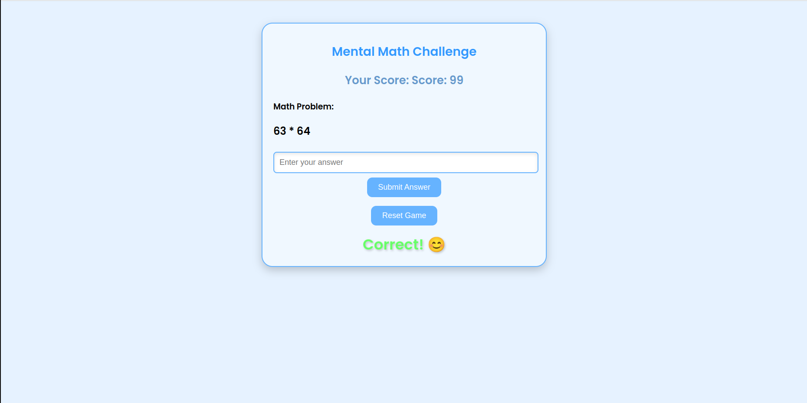

This app dynamically generates math problems, adjusts difficulty based on performance, and interfaces with a robot using **ROS2**.



## Features

- Dynamic math problem generation (addition, subtraction, multiplication).
- Three difficulty levels (easy, medium, hard) that adjust based on user performance.
- Real-time feedback (correct/incorrect).
- ROS2 integration for robot feedback (happy/sad reactions).

## Requirements

- Python 3.x
- Flask
- ROS2

### Install dependencies:

```bash
pip install -r requirements.txt
```

### Run the app:

```bash
python app.py
```

Open your browser and navigate to `http://localhost:5000`.

## File Structure

```
mental-math-app/
├── src/
│   ├── __init__.py
│   ├── app.py
│   └── robot_interface.py
├── static/
│   ├── app.js
│   └── style.css
├── templates/
│   └── index.html
└── requirements.txt
```

## ROS2 Integration

- Publishes to the `face_state` topic using `robot_interface.py`.
- Robot should subscribe to this topic for feedback (happy/sad reactions).